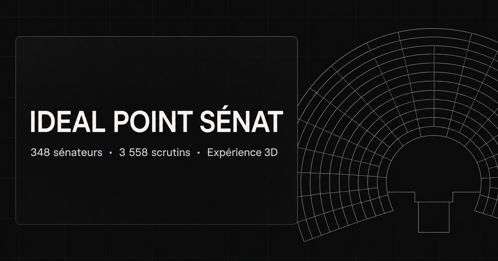

# Ideal Point Sénat

Visualisation des positions de vote des 348 sénateurs français pour la législature 2023 à 2026.

[Ouvrir la visualisation 3D](https://ideal-point-senat-3d.aware-harp-9471.chatgpt.site)

[Lire la méthode et les limites](https://ideal-point-senat-3d.aware-harp-9471.chatgpt.site/about.html)

[Consulter le rapport](docs/Rapport_OSCAR_BRUNEL_positions_vote_Senat_IDEAL.pdf)



## Principe

Le projet part des votes publics individuels du Sénat. Un modèle Ideal Point bayésien estime la position de chaque sénateur dans un espace à deux dimensions. Deux sénateurs qui votent souvent de la même manière sont placés près l'un de l'autre. Des comportements de vote opposés produisent des positions plus éloignées.

La maquette 3D utilise ensuite ces coordonnées pour distribuer les 348 sénateurs dans l'hémicycle. Le placement affiché ne correspond pas au plan officiel des groupes politiques. Les sièges suivent les positions estimées à partir des votes.

La fiche d'un sénateur présente sa position dans le nuage, son rang sur l'axe gauche droite, sa distance au centre de son groupe, sa loyauté de vote et son abstention.

## Chiffres du modèle

| Élément | Valeur |
| --- | ---: |
| Sénateurs actifs | 348 |
| Scrutins publics bruts | 4 759 |
| Votes publics bruts | 698 455 |
| Scrutins retenus | 3 558 |
| Votes exploitables | 482 544 |
| Dimensions latentes | 2 |

## Méthode

1. Les votes individuels sont associés aux sénateurs actifs.
2. Seuls les votes pour et contre sont utilisés dans la matrice du modèle. Les abstentions et absences sont traitées comme manquantes.
3. Les scrutins dont la part minoritaire est inférieure à 10 % sont écartés.
4. Un sénateur doit disposer d'au moins 25 votes exprimés après filtrage.
5. Le modèle `pscl::ideal` est estimé avec deux dimensions, 1 000 itérations, 500 itérations de rodage et un pas de 25.
6. Le premier axe est orienté pour placer la gauche en valeurs négatives et la droite en valeurs positives.
7. Les coordonnées sont pondérées comme dans le notebook, avec un coefficient de 1 pour la dimension 1 et de 0,564 pour la dimension 2.

Le modèle peut être résumé par une probabilité de vote de la forme suivante :

```text
P(vote pour) = Phi(beta' x_i - alpha)
```

`x_i` désigne la position latente du sénateur. Les paramètres du scrutin décrivent sa difficulté et sa capacité à séparer les positions.

## Lecture des axes

La dimension 1 correspond au clivage gauche droite qui émerge des votes. La dimension 2 capte une opposition secondaire. Dans cette estimation, le RDPI se situe plus haut sur le second axe.

Ces coordonnées décrivent une position de vote révélée sur les scrutins sélectionnés. Elles ne mesurent pas toute l'idéologie d'une personne. La discipline de groupe, la sélection des textes soumis au vote public et les abstentions influencent le résultat.

## Notebook et données

Le notebook utilisé pour l'estimation est disponible ici :

[`notebooks/senat_ideal_point_model_R_simple.ipynb`](notebooks/senat_ideal_point_model_R_simple.ipynb)

Les tables utilisées sont dans [`data/model_ready`](data/model_ready). Le fichier principal est compressé pour respecter les limites de taille de GitHub.

```bash
gunzip -k data/model_ready/votes_senateurs_actifs.csv.gz
```

Le détail des fichiers, leur provenance et leurs sommes de contrôle se trouvent dans [`data/README.md`](data/README.md).

Les coordonnées utilisées par l'application sont dans [`_recovery/points_ideal_weighted_full.csv`](_recovery/points_ideal_weighted_full.csv). Le fichier [`public/data/senators.json`](public/data/senators.json) contient les données chargées par le site.

## Reproduire l'estimation

Prérequis R : `tidyverse` et `pscl`.

```bash
gunzip -k data/model_ready/votes_senateurs_actifs.csv.gz
Rscript _recovery/run_ideal_notebook.R
python3 scripts/build_json_from_ideal.py
```

Le notebook reste la source de vérité pour la méthode, l'orientation des axes et les pondérations.

## Lancer le site

Prérequis : Node.js 18 ou plus récent.

```bash
npm install
npm run dev
```

La build de production se lance avec :

```bash
npm run build
```

## Structure du dépôt

| Chemin | Contenu |
| --- | --- |
| `index.html` | Visualisation 3D, recherche et fiches sénateurs |
| `about.html` | Présentation de la méthode, des limites et des références |
| `src/main.js` | Scène Three.js, hémicycle, sièges et interactions |
| `src/idealScatter.js` | Nuage Ideal Point utilisé dans les différentes vues |
| `public/data/senators.json` | Données servies à l'application |
| `notebooks/` | Notebook de l'estimation |
| `data/model_ready/` | Tables préparées pour le modèle |
| `_recovery/` | Script R, résultats du modèle et coordonnées pondérées |
| `docs/` | Rapport du projet |

## Références

Les références méthodologiques et les sources de données sont regroupées dans [`REFERENCES.md`](REFERENCES.md).

## Auteur

Oscar Brunel

[LinkedIn](https://www.linkedin.com/in/oscar-brunel-624657334/)

[bruneloscar@gmail.com](mailto:bruneloscar@gmail.com)

Ce dépôt ne contient pas de fichier de licence pour le code. Les données du Sénat et les éléments visuels externes restent soumis aux conditions de leurs sources respectives.
